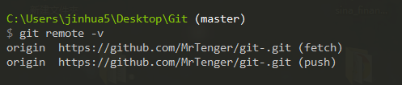
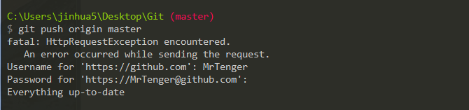

#### 如何保持github上fork的项目与原项目同步

在我的主页上有一个项目“useful-utils”,可以看到，它是从“383514580/useful-utils”fork来的。


- 将自己主页的项目clone到本地

```
git clone https://github.com/MrTenger/useful-utils.git
```
- 此时查看项目的远程信息，发现都是关于我自己主页的，origin是分支名称，如下图：

```
git remote -v
```



- 此时为项目添加远程分支，如下图：

```
git remote add upstream https://github.com/383514580/useful-utils.git
```


- 如果远程项目进行了更新，我们则需要从upstream上拉取，这样本地代码就和原作者的代码保持同步了，如下图：

```
git pull upstream master
```


- 将本地代码提交到自己的分支上，即origin，这样自己的主页上的项目就和原作者的项目代码进行了同步，如下图：

```
git push origin master
```


总结：实现fork的项目和原项目保持同步的办法就是利用本地项目作为“中转”，为本地的项目添加两个远程信息，拉取原仓库的新代码，然后push到自己的仓库，就达到了同步。
